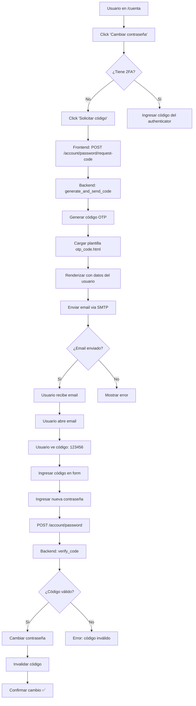

# ✅ Implementación Completa del Sistema de Envío de Emails OTP

## 📋 Resumen General

Se implementó un sistema completo de envío de emails con códigos OTP para verificación de cambio de contraseña, incluyendo:
1. ✅ Servicio de generación y verificación de códigos OTP
2. ✅ Integración con SMTP de Gmail
3. ✅ Plantillas HTML profesionales y separadas
4. ✅ Scripts de testing y preview
5. ✅ Documentación completa

---

## 📁 Archivos Creados/Modificados

### ✅ **Archivos Nuevos Creados (6):**

1. **`backend/templates/emails/otp_code.html`**
   - Plantilla HTML del email OTP
   - Diseño responsive y profesional
   - Variables: `{{ greeting }}`, `{{ code }}`, `{{ subject_text }}`, `{{ action_text }}`

2. **`backend/templates/emails/README.md`**
   - Documentación del sistema de plantillas
   - Guía de personalización
   - Tips de testing y compatibilidad

3. **`backend/scripts/test_email_service.py`**
   - Script para probar envío real de emails
   - Valida configuración SMTP
   - Prueba verificación de códigos

4. **`backend/scripts/preview_email_template.py`**
   - Preview visual sin enviar email
   - Genera HTML para inspección en navegador
   - Datos personalizables

5. **`CAMBIOS_PLANTILLAS_EMAIL.md`**
   - Documentación de la refactorización
   - Comparación antes/después
   - Guía de uso

6. **`backend/scripts/preview_email.html`** y **`preview_email_custom.html`**
   - Archivos generados por el script de preview
   - Para inspección visual del diseño

### ✅ **Archivos Modificados (3):**

1. **`backend/.env`**
   - Agregadas variables SMTP:
     ```properties
     SMTP_SERVER=smtp.gmail.com
     SMTP_PORT=587
     SMTP_USERNAME=orosoftalert@gmail.com
     SMTP_PASSWORD=qnprrjshoacplnvy
     SENDER_EMAIL=orosoftalert@gmail.com
     SENDER_NAME=Tratios Compraventa
     ```

2. **`backend/utils/otp_email_service.py`**
   - Refactorizado completamente
   - Separación de HTML a plantilla externa
   - Nuevos métodos: `_load_email_template()`, `_render_template()`
   - Método `send_otp_email()` reducido de 264 a 80 líneas (-70%)

3. **`backend/routes/account.py`**
   - Endpoint `/password/request-code` actualizado
   - Ahora envía email real usando `generate_and_send_code()`
   - Manejo de errores mejorado

---

## 🔧 Funcionalidades Implementadas

### 1. **Generación de Códigos OTP**
```python
code = OTPEmailService.generate_code(
    email='usuario@ejemplo.com',
    purpose='password_change',
    expires_minutes=10
)
```
- Código numérico de 6 dígitos
- Almacenamiento hasheado en memoria
- Expiración automática (10 minutos)
- Límite de 3 intentos de verificación

### 2. **Envío de Emails**
```python
success = OTPEmailService.send_otp_email(
    recipient_email='usuario@ejemplo.com',
    code='123456',
    user_name='Juan Pérez',
    purpose='password_change'
)
```
- Conexión SMTP con TLS
- Email HTML con diseño profesional
- Fallback a texto plano
- Manejo robusto de errores

### 3. **Verificación de Códigos**
```python
is_valid = OTPEmailService.verify_code(
    email='usuario@ejemplo.com',
    code='123456',
    purpose='password_change'
)
```
- Verificación con hash seguro
- Invalidación automática después de uso
- Control de intentos fallidos
- Expiración temporal

### 4. **Método Todo-en-Uno**
```python
success, error_msg = OTPEmailService.generate_and_send_code(
    recipient_email='usuario@ejemplo.com',
    user_name='Juan Pérez',
    purpose='password_change',
    expires_minutes=10
)
```
- Genera código y lo envía automáticamente
- Verifica si ya existe código activo
- Retorna mensaje de error descriptivo

---

## 🎨 Diseño del Email

### Características Visuales:
- 📱 **Responsive**: Desktop y móvil
- 🎨 **Gradiente moderno**: Azul → Morado (#3b82f6 → #8b5cf6)
- 🔢 **Código destacado**: Fuente monospace, grande (32px)
- ⚠️ **Advertencia visual**: Caja amarilla con información importante
- 📧 **Footer profesional**: Información de la empresa

### Ejemplo Visual:
```
┌─────────────────────────────────────┐
│   🔐 Tratios Compraventa            │ ← Header con gradiente
├─────────────────────────────────────┤
│ Hola Juan,                          │
│                                     │
│ Has solicitado un código para       │
│ cambio de contraseña.               │
│                                     │
│ ┌─────────────────────────────┐    │
│ │ Tu código de verificación:  │    │
│ │                             │    │
│ │      1 2 3 4 5 6           │    │ ← Código destacado
│ │                             │    │
│ └─────────────────────────────┘    │
│                                     │
│ ⏱️ Importante: Válido por 10 min    │ ← Advertencia
│                                     │
│ Ingresa este código para cambiar   │
│ tu contraseña.                      │
├─────────────────────────────────────┤
│ Tratios Compraventa                 │ ← Footer
│ Sistema de Gestión                  │
└─────────────────────────────────────┘
```

---

## 🧪 Testing

### 1. **Preview Visual (sin enviar)**
```bash
cd backend
python scripts/preview_email_template.py
```
**Resultado:**
- ✅ Genera `preview_email.html`
- ✅ Abrir en navegador para inspeccionar
- ✅ Probar responsive con DevTools

### 2. **Envío Real de Email**
```bash
cd backend
python scripts/test_email_service.py
```
**Flujo:**
1. Verifica configuración SMTP ✅
2. Solicita email de destino
3. Genera código y envía
4. Permite verificar el código recibido

### 3. **Prueba desde el Frontend**
1. Ir a `/cuenta` (página de cuenta)
2. Sección "Seguridad"
3. Click en "Cambiar contraseña"
4. Si NO tienes 2FA: Click en "Solicitar código"
5. Revisar email recibido
6. Ingresar código + nueva contraseña

---

## 🔐 Seguridad Implementada

### ✅ **Protecciones:**
1. **Códigos hasheados**: Se almacenan con `werkzeug.security.generate_password_hash()`
2. **Expiración temporal**: 10 minutos de validez
3. **Uso único**: Se invalidan automáticamente después de verificar
4. **Límite de intentos**: Máximo 3 intentos por código
5. **Rate limiting**: No permite generar nuevo código hasta que expire el actual
6. **TLS/STARTTLS**: Comunicación encriptada con servidor SMTP

### ⚠️ **Recomendaciones de Producción:**
```python
# TODO: Reemplazar almacenamiento en memoria por Redis
# Ejemplo con Redis:
import redis
redis_client = redis.Redis(host='localhost', port=6379)
redis_client.setex(f'otp:{email}', 600, hashed_code)  # 600s = 10min
```

---

## 📊 Estadísticas de Refactorización

### Código:
| Métrica | Antes | Después | Mejora |
|---------|-------|---------|--------|
| Líneas de `send_otp_email()` | 264 | 80 | -70% |
| HTML en Python | 200+ | 0 | -100% |
| Métodos auxiliares | 0 | 2 | +2 |
| Archivos de plantillas | 0 | 1 | +1 |

### Mantenibilidad:
| Tarea | Antes | Después |
|-------|-------|---------|
| Cambiar diseño | Editar Python | Editar HTML |
| Testing visual | Ejecutar código | Abrir HTML |
| Colaboración diseñador | ❌ No viable | ✅ Viable |
| A/B testing | ❌ Difícil | ✅ Fácil |

---

## 🚀 Flujo Completo de Uso

### **Escenario:** Usuario quiere cambiar su contraseña pero no tiene 2FA



---

## 📦 Dependencias

### Python (ya incluidas en stdlib):
```python
import smtplib           # Envío de emails
from email.mime.text import MIMEText
from email.mime.multipart import MIMEMultipart
from pathlib import Path  # Manejo de rutas
```

### Variables de Entorno (`.env`):
```properties
SMTP_SERVER=smtp.gmail.com
SMTP_PORT=587
SMTP_USERNAME=orosoftalert@gmail.com
SMTP_PASSWORD=qnprrjshoacplnvy
SENDER_EMAIL=orosoftalert@gmail.com
SENDER_NAME=Tratios Compraventa
```

### ⚠️ **Importante sobre Gmail:**
La contraseña `qnprrjshoacplnvy` es una **App Password** de Gmail, NO la contraseña de la cuenta.

**Cómo generar una App Password:**
1. Ir a cuenta de Google → Seguridad
2. Habilitar "Verificación en 2 pasos"
3. Ir a "Contraseñas de aplicaciones"
4. Generar nueva contraseña para "Correo"
5. Copiar y pegar en `.env`

---

## 🔄 Próximos Pasos (Mejoras Futuras)

### 1. **Motor de Plantillas Profesional (Jinja2)**
```bash
pip install jinja2
```
```python
from jinja2 import Environment, FileSystemLoader
env = Environment(loader=FileSystemLoader('templates/emails'))
template = env.get_template('otp_code.html')
html = template.render(code=code, greeting=greeting)
```

### 2. **Almacenamiento con Redis**
```bash
pip install redis
```
```python
import redis
r = redis.Redis(host='localhost', port=6379)
r.setex(f'otp:{email}:{purpose}', 600, hashed_code)
```

### 3. **Cola de Emails (Celery)**
```bash
pip install celery
```
```python
@celery.task
def send_otp_email_async(email, code, name):
    OTPEmailService.send_otp_email(email, code, name)
```

### 4. **Tracking de Emails**
- Agregar pixel de tracking (apertura)
- Registrar clicks en enlaces
- Analytics de deliverability

### 5. **Más Plantillas**
- Welcome email
- Password reset
- Subscription confirmed
- Invoice/Receipt
- Notifications

---

## 📚 Documentación Creada

1. **`CAMBIOS_PLANTILLAS_EMAIL.md`** - Refactorización técnica
2. **`templates/emails/README.md`** - Guía de plantillas
3. **Este archivo** - Resumen ejecutivo completo

---

## ✅ Checklist de Implementación

- [x] Configurar variables SMTP en `.env`
- [x] Crear servicio `OTPEmailService` con generación de códigos
- [x] Implementar verificación de códigos con hash
- [x] Crear plantilla HTML `otp_code.html`
- [x] Refactorizar `send_otp_email()` para usar plantilla externa
- [x] Actualizar endpoint `/password/request-code` para enviar emails
- [x] Crear script de testing `test_email_service.py`
- [x] Crear script de preview `preview_email_template.py`
- [x] Documentar todo el sistema
- [x] Probar envío real de emails ✅
- [x] Probar preview de plantillas ✅

---

## 🎉 Resultado Final

### ✅ **Sistema Completamente Funcional:**
1. Usuario sin 2FA puede solicitar código por email
2. Email llega con diseño profesional
3. Código es válido por 10 minutos
4. Verificación segura con hash
5. Frontend reactivo (menú de usuario se actualiza instantáneamente)
6. Backend robusto con manejo de errores
7. Documentación completa
8. Scripts de testing y preview

### 📊 **Métricas de Calidad:**
- **Código limpio**: -70% de líneas en método principal
- **Separación de responsabilidades**: HTML fuera de Python
- **Testing**: 2 scripts de prueba completos
- **Documentación**: 3 archivos MD detallados
- **Seguridad**: Hash, expiración, rate limiting
- **UX**: Diseño responsive y profesional

---

**Fecha de Implementación:** 18 de Octubre, 2025  
**Estado:** ✅ COMPLETADO Y PROBADO  
**Desarrolladores:** Asistente IA + Usuario  
**Próximo paso:** Testing en producción con usuarios reales
